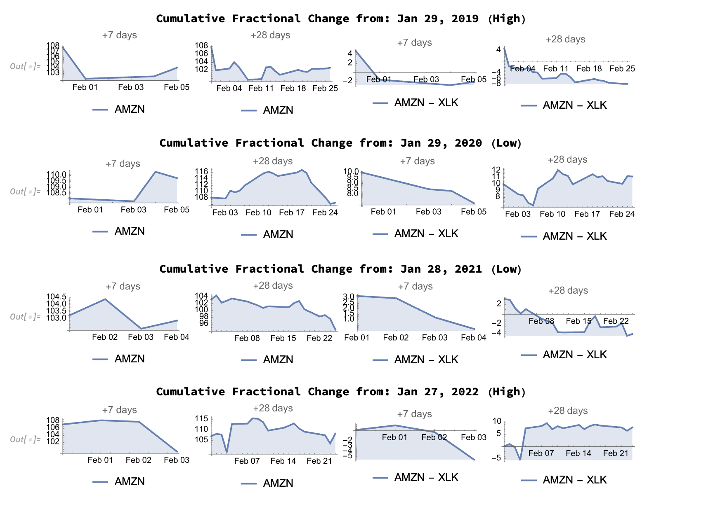

# SEC Filing Similarity Indexing for Trading Signals

## Description

This project leverages Wolfram Mathematica to analyze and compare the language and word usage in SEC filings from consecutive years for eight large-cap technology companies. The goal is to investigate the correlation between the similarity of language used in these filings and the companies' stock performance, independent of market returns.

## Getting Started

### Dependencies
- Wolfram Mathematica 13.3 or later.
- Access to SEC filing data sources.

### Installation
- Ensure Wolfram Mathematica is installed on your system.
- Clone this repository to your local machine.
- Download SEC filings data and place it in the designated data directory.

### Executing the Analysis
- Run the Mathematica notebook to extract words from SEC filings and calculate similarity scores.
- Perform the market analysis using the provided functions.

## Results

Based on our analysis, we found the following patterns in similarity scores and their corresponding stock returns:

- **Apple**: Low similarity scores are associated with positive returns, while high similarity scores are associated with negative returns.
- **Microsoft & Google**: No clear pattern for low similarity scores, but high similarity scores generally result in negative returns.
- **IBM**: Low similarity scores are associated with negative returns, with no clear pattern for high similarity scores.
- **AMD**: Low similarity scores correlate with positive returns, while high similarity scores correlate with negative returns.
- **Meta, Amazon & Netflix**: Both low and high similarity scores correlate with negative returns.

Overall, our findings do not indicate a consistent correlation between low similarity scores and positive returns across the companies analyzed. Further statistical validation is required.

### Cumulative Fractional Change Analysis
The graph below illustrates the pattern observed in the cumulative fractional change in stock price compared to the benchmark ETF for one of the analyzed companies over two different post-filing time windows.

*Please note that the graph is for illustrative purposes and should be replaced with the actual output graph from your analysis.*

## How to Use This Code for Further Analysis

### Expanding the Analysis
The methodologies and code provided can be adapted for further financial analysis:

1. **Incorporating a Multi-Factor Risk Model**: To get a more accurate measure of stock performance that accounts for market exposure.

2. **Extending the Analysis Window**: To determine how the incorporation of information into stock prices may vary over different time frames.

3. **Applying to Different Market Caps**: To observe potential differences in patterns between small-cap, mid-cap, and large-cap companies due to the scale of business operations.

### Application in Financial Decision-Making
- Use the insights provided by this analysis as one component of a multifaceted investment strategy.
- Validate these findings with additional market research and statistical analysis.
- Combine this analysis with other investment tools for a holistic approach to stock market investment.

## Authors
- [Krish](gk0001va@gmail.com)

## License
This project is licensed under the MIT License - see the LICENSE.md file for details.

## Acknowledgments
- Financial market analysis theories and methodologies.
- Wolfram Research for Mathematica software.
- To my wonderful groupmates, Nikhil, Subham, Rushali, Tejaswi

